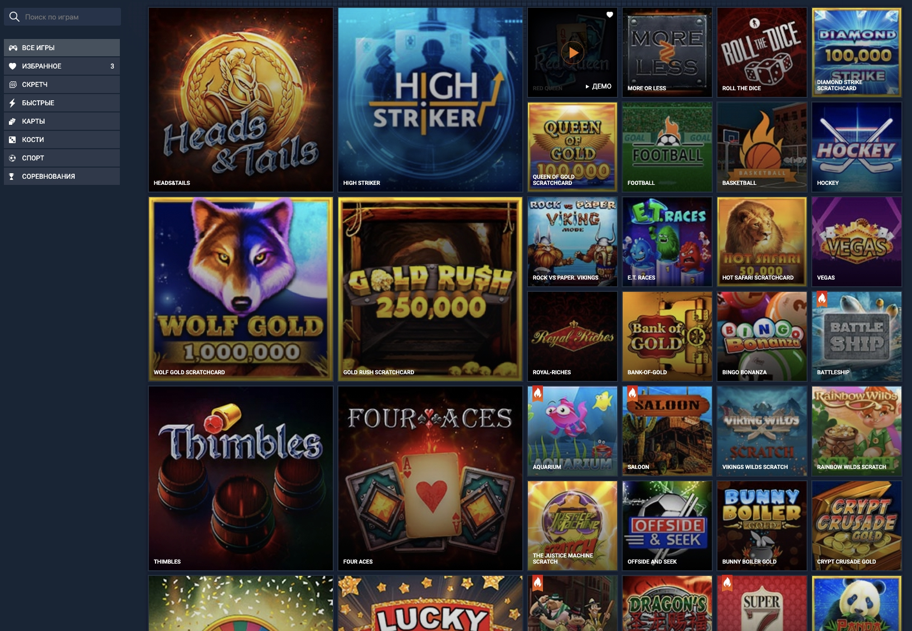

# Тестовое задание для фронтенд-разработчика

## Задача
- асинхронно загрузить файл `data/gamesList.json`
- реализовать боковое меню, включащее несколько пунктов:
    - из блока `categories` в `gamesList.json`
    - "Избранное" со счетчиком количества игр в этом пункте    
- справа от меню отобразить плитки игр   
    - для каждой категории указан список игр
    - если у игры поле `top: true`, то картинка будет большой `large`
    - все большие картинки должны быть слева в 2 столбца, остальные занимают все оставшееся место на экране
    - если картинки у игры нет или недоступна, то должна отображаться заглушка и название игры
- реализовать добавление и удаление в избранное

## Требования
- технологии
    - в зависимости от вакансии
- дизайн
    - на усмотрение исполнителя
    - адаптивный
    - картинки, заглушки и иконки избранного лежат в папке `assets`

### Пример

